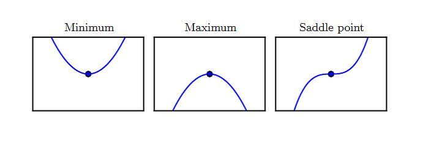
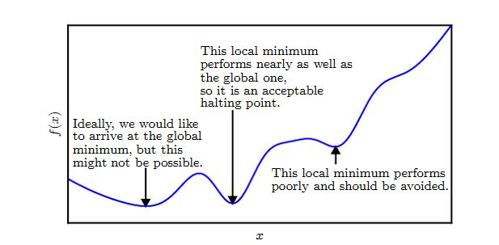
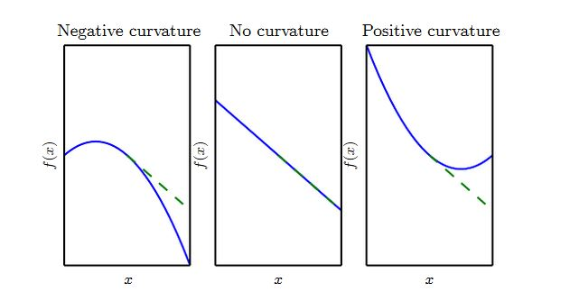
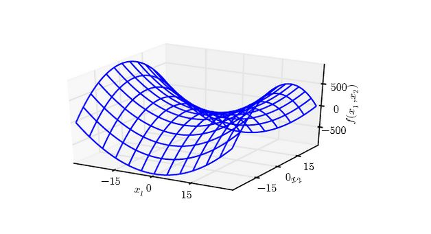
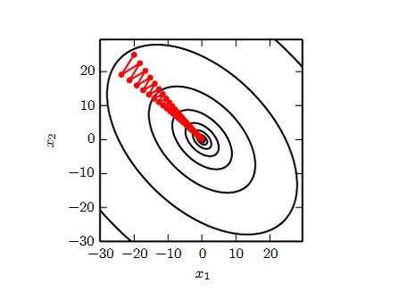

# 章4 数值计算

## 一、数值稳定性
1.  在计算机中执行数学运算的一个核心困难是：我们需要使用有限的比特位来表达无穷多的实数。这意味着我们在计算机中表示实数时，会引入近似误差。近似误差可以在多步数值运算中传递、积累从而导致理论上成功的算法会失败。因此数值算法设计时要考虑将累计误差最小化。

2. 上溢出`overflow`和下溢出`underflow`：
	-  一种严重的误差是下溢出：当接近零的数字四舍五入为零时，发生下溢出。许多函数在参数为零和参数为一个非常小的正数时，行为是不同的。如对数函数要求自变量大于零；除法中要求除数非零。
	- 另一种严重的误差是上溢出：当数值非常大，超过了计算机的表示范围时，发生上溢出。

3. 一个数值稳定性的例子是`softmax`函数。`softmax`函数经常用于 `multinoulli`分布。设 \\(\mathbf{\vec x}=(x_1,x_2,\cdots,x_n)^{T}\\)，则`softmax`函数定义为：
	$$\text{softmax}(\mathbf{\vec x})=\left(\frac{\exp(x_1)}{\sum\_{j=1}^{n}\exp(x_j)},\frac{\exp(x_2)}{\sum\_{j=1}^{n}\exp(x_j)},\cdots,\frac{\exp(x_n)}{\sum\_{j=1}^{n}\exp(x_j)}\right)^{T} $$
	当所有的 \\(x_i\\) 都等于常数 \\(c\\) 时，`softmax`函数的每个分量的理论值都为 \\(\frac 1n\\)
	- 考虑 \\(c\\) 是一个非常大的负数（比如趋近负无穷），此时 \\(\exp( c)\\) 下溢出。此时 \\( \frac{\exp(c )}{\sum\_{j=1}^{n}\exp(c )}\\) 分母为零，结果未定义。
	- 考虑 \\(c\\) 是一个非常大的正数（比如趋近正无穷），此时 \\(\exp( c)\\) 上溢出。 \\( \frac{\exp(c )}{\sum\_{j=1}^{n}\exp(c )}\\)   的结果未定义。

	解决的办法是：令 \\(\mathbf{\vec z}=\mathbf{\vec x}-\max\_i x_i\\)，则有 \\(\text{softmax}(\mathbf{\vec z}) \\) 的第 \\(i\\) 个分量为：
	$$ 
	\text{softmax}(\mathbf{\vec z})\_i=\frac{\exp(z_i)}{\sum\_{j=1}^{n}\exp(z_j)}=\frac{\exp(\max\_k x_k)\exp(z_i)}{\exp(\max\_k x_k)\sum\_{j=1}^{n}\exp(z_j)}\\\
	=\frac{\exp(z_i+\max\_k x_k)}{\sum\_{j=1}^{n}\exp(z_j+\max\_k x_k)}\\\
	=\frac{\exp(x_i)}{\sum\_{j=1}^{n}\exp(x_j)}\\\
	=\text{softmax}(\mathbf{\vec x})\_i
	$$
	- 当 \\(\mathbf{\vec x} \\)  的分量较小时， \\(\mathbf{\vec z} \\) 的分量至少有一个为零，从而导致 \\(\text{softmax}(\mathbf{\vec z})\_i\\) 的分母至少有一项为 1，从而解决了下溢出的问题。
	- 当  \\(\mathbf{\vec x} \\)  的分量较大时，\\(\text{softmax}(\mathbf{\vec z})\_i\\) 相当于分子分母同时除以一个非常大的数  \\(\exp(\max\_i x_i)\\) ，从而解决了上溢出。

	但是还有个问题：当 \\(\mathbf{\vec x} \\)  的分量较小时， \\(\text{softmax}(\mathbf{\vec x})\_i\\)  的计算结果可能为 0 （此时不再是未定义的。因此分母非零，分子趋近于零）。此时：  \\(\log \text{softmax}(\mathbf{\vec x})\\) 趋向于负无穷，非数值稳定的。因此我们需要设计专门的函数来计算 \\(\log\text{softmax}\\) ，而不是将 \\(\text{softmax}\\) 的结果传递给 \\(\log\\) 函数。

4. 当我们需要从头开始实现一个数值算法时，我们需要考虑数值稳定性。当我们使用现有的数值计算库时，不需要考虑数值稳定性。

## 二、  Conditioning
1. `Conditioning`刻画了一个函数的如下特性：当函数的输入发生了微小的变化时，函数的输出的变化有多大。
	- 对于`Conditioning`较大的函数，在数值计算中可能有问题。因为函数输入的舍入误差可能导致函数输出的较大变化。

2. 对于方阵 \\(\mathbf A\in \mathbb R^{n\times n}\\) ，其条件数`condition number`为：
	$$\text{condition number}=\max\_{1\le i,j\le n,i\ne j}\left|\frac{\lambda\_i}{\lambda\_j} \right|$$
	其中 \\(\lambda_i,i=1,2,\cdots,n\\) 为 \\(\mathbf A\\) 的特征值。方阵的条件数就是最大的特征值除以最小的特征值。当方阵的条件数很大时，矩阵的求逆将对误差特别敏感（即： \\(\mathbf A\\) 的一个很小的扰动，将导致其逆矩阵一个非常明显的变化）。
	- 条件数是矩阵本身的特性，它会放大那些包含矩阵求逆运算过程中的误差。

## 三、基于梯度的优化算法

### 1. 一维函数

1. 满足导数为零的点（即 \\(f^{\prime}(x)=0\\) ）称作驻点。驻点可能为下面三种类型之一：
	- 局部极小点：在 \\(x\\) 的一个邻域内，该点的值最小
	- 局部极大点：在 \\(x\\) 的一个邻域内，该点的值最大
	- 鞍点：既不是局部极小，也不是局部极大

	

2. 全局极小点：\\(x^{\*}=\arg\min\_x f(x)\\)。 
	- 全局极小点可能有一个或者多个
	- 在深度学习中，我们的目标函数很可能具有非常多的局部极小点，以及许多位于平坦区域的鞍点。这使得优化非常不利。因此我们通常选取一个非常低的目标函数值，而不一定要是全局最小值。
	

### 2. 多维函数

1. 对于函数： \\(f:\mathbb R^{n} \rightarrow \mathbb R\\)，输入为多维的。假设输入 \\(\mathbf{\vec x}=(x_1,x_2,\cdots,x_n)^{T}\\)，则定义梯度：
	$$\nabla \_{\mathbf{\vec x}} f(\mathbf{\vec x})=\left(\frac{\partial}{\partial x_1}f(\mathbf{\vec x}),\frac{\partial}{\partial x_2}f(\mathbf{\vec x}),\cdots,\frac{\partial}{\partial x_n}f(\mathbf{\vec x})\right)^{T}$$
	- 驻点满足： \\(\nabla \_{\mathbf{\vec x}} f(\mathbf{\vec x})=\mathbf{\vec 0}\\)

2. 沿着方向 \\(\mathbf{\vec u}\\) 的方向导数`directional derivative`定义为：
		$$\lim\_{\alpha\rightarrow 0}\frac{f(\mathbf{\vec x}+\alpha\mathbf{\vec u})-f(\mathbf{\vec x})}{\alpha} $$
		其中  \\(\mathbf{\vec u}\\)  为单位向量。

	方向导数就是 \\(\frac{\partial}{\partial \alpha}f(\mathbf{\vec x}+\alpha\mathbf{\vec u})\\)。根据链式法则，它也等于 \\(\mathbf{\vec u}^{T}\nabla \_{\mathbf{\vec x}} f(\mathbf{\vec x})\\)

3. 为了最小化 \\(f\\)，我们寻找一个方向：沿着该方向，函数值减少的速度最快（换句话说，就是增加最慢）。即：
	$$
	\min\_{\mathbf{\vec u}}  \mathbf{\vec u}^{T}\nabla \_{\mathbf{\vec x}} f(\mathbf{\vec x})\\\
	s.t.\quad ||\mathbf{\vec u}||_2=1
	$$
	求解这个最优化问题很简单。假设 \\(\mathbf{\vec u}\\) 与梯度的夹角为 \\(\theta\\)，则目标函数等于：
	$$||\mathbf{\vec u}||\_2||\nabla \_{\mathbf{\vec x}} f(\mathbf{\vec x})||\_2 \cos\theta$$
 	考虑到 \\(||\mathbf{\vec u}||\_2=1\\)，以及梯度的大小与 \\(\theta\\) 无关，于是上述问题转化为：
	$$ \min\_\theta \cos\theta$$
	于是： \\(\theta^{\*}=\pi\\)，即  \\(\mathbf{\vec u}\\) 沿着梯度的相反的方向。即：梯度的方向是函数值增加最快的方向，梯度的相反方向是函数值减小的最快的方向。我们可以沿着负梯度的方向来降低 \\(f\\) 的值，这就是梯度下降法。

4. 根据梯度下降法，我们为了寻找 \\(f\\) 的最小点，我们的迭代过程为：
	 $$\mathbf{\vec x}^{\prime}= \mathbf{\vec x}-\epsilon\nabla \_{\mathbf{\vec x}} f(\mathbf{\vec x})$$
	迭代结束条件为：梯度向量 \\(\nabla \_{\mathbf{\vec x}} f(\mathbf{\vec x})\\) 的每个成分为零或者非常接近零。

	其中 \\(\epsilon\\) 为学习率，它是一个正数，决定了迭代的步长。选择学习率有多种方法：
	- 一种方法是：选择  \\(\epsilon\\) 为一个小的、正的常数
	- 另一种方法是：给定多个 \\(\epsilon\\)，然后选择使得 \\(f(\mathbf{\vec x}-\epsilon\nabla \_{\mathbf{\vec x}} f(\mathbf{\vec x}))\\) 最小的那个值作为本次迭代的学习率。这种办法叫做线性搜索`line search`
	- 第三种方法是：求得使 \\(f(\mathbf{\vec x}-\epsilon\nabla \_{\mathbf{\vec x}} f(\mathbf{\vec x}))\\) 取极小值的 \\(\epsilon\\)，即求解最优化问题：
		$$ \epsilon^{\*}=\arg\min\_{\epsilon,\epsilon \gt 0 }f(\mathbf{\vec x}-\epsilon\nabla \_{\mathbf{\vec x}} f(\mathbf{\vec x}))$$
		这种方法也称作最速下降法。
		- 在最速下降法中，假设相邻的三个迭代点分别为： \\(\mathbf{\vec x}^{<k\>},\mathbf{\vec x}^{<k+1\>},\mathbf{\vec x}^{<k+2\>}\\)，可以证明：  \\((\mathbf{\vec x}^{<k+1\>}-\mathbf{\vec x}^{<k\>})\cdot (\mathbf{\vec x}^{<k+2\>}-\mathbf{\vec x}^{<k+1\>})=0\\)。即相邻的两次搜索的方向是正交的！
 
5. 有些情况下，如果梯度向量 \\(\nabla \_{\mathbf{\vec x}} f(\mathbf{\vec x})\\)  的形式比较简单，我们可以直接求解方程：
	 $$\nabla \_{\mathbf{\vec x}} f(\mathbf{\vec x})=\mathbf{\vec 0} $$
	这时不用任何迭代，直接获得解析解。

### 3. 二阶导数
1. 二阶导数 \\(f^{\prime\prime}(x)\\) 刻画了曲率。假设我们有一个二次函数（实际任务中，很多函数不是二次的，但是在局部我们可以近似为二次函数）：
	- 如果函数的二阶导数为零，则它是一条直线。如果梯度为1，则当我们沿着负梯度的步长为 \\(\epsilon\\) 时，函数值减少 \\(\epsilon\\) 
	- 如果函数的二阶导数为负，则函数向下弯曲。如果梯度为1，则当我们沿着负梯度的步长为 \\(\epsilon\\) 时，函数值减少大于 \\(\epsilon\\) 
	- 如果函数的二阶导数为正，则函数向上弯曲。如果梯度为1，则当我们沿着负梯度的步长为 \\(\epsilon\\) 时，函数值减少少于 \\(\epsilon\\) 
	

2. 当函数输入为多维时，我们定义海森矩阵：
	$$\mathbf H(f)(\mathbf{\vec x}) =\begin{bmatrix}
	\frac{\partial^{2}}{\partial x\_1\partial x\_1}f&\frac{\partial^{2}}{\partial x\_1\partial x\_2}f&\cdots&\frac{\partial^{2}}{\partial x\_1\partial x\_n}f\\\
\frac{\partial^{2}}{\partial x\_2\partial x\_1}f&\frac{\partial^{2}}{\partial x\_2\partial x\_2}f&\cdots&\frac{\partial^{2}}{\partial x\_2\partial x\_n}f\\\
	\vdots&\vdots&\ddots&\vdots\\\
\frac{\partial^{2}}{\partial x\_n\partial x\_1}f&\frac{\partial^{2}}{\partial x\_n\partial x\_2}f&\cdots&\frac{\partial^{2}}{\partial x\_n\partial x\_n}f
	\end{bmatrix}$$	 
	即海森矩阵的第 \\(i\\) 行 \\(j\\) 列元素为：
	$$\mathbf H\_{i,j}=\frac{\partial^{2}}{\partial x\_i\partial x\_j}f(\mathbf{\vec x}) $$
	- 当二阶偏导是连续时，海森矩阵是对称阵，即有： \\(\mathbf H=\mathbf H^{T}\\) 。在深度学习中，我们遇到的大多数海森矩阵都是对称阵。
	- 对于特定方向 \\(\mathbf{\vec d}\\) 上的二阶导数：
		- 如果  \\(\mathbf{\vec d}\\) 是海森矩阵的特征值，则该方向的二阶导数就是对应的特征值
		- 如果 \\(\mathbf{\vec d}\\) 不是海森矩阵的特征值，则该方向的二阶导数就是所有特征值的加权平均，权重在 `(0,1)`之间。且与 \\(\mathbf{\vec d}\\) 夹角越小的特征向量对应的特征值具有更大的权重。
	- 最大特征值确定了最大二阶导数，最小特征值确定最小二阶导数。

3. 我们将 \\(f(\mathbf{\vec x})\\) 在 \\(\mathbf{\vec x}\_0\\) 处泰勒展开：
	$$f(\mathbf{\vec x}) \approx f(\mathbf{\vec x}\_0)+(\mathbf{\vec x}-\mathbf{\vec x}\_0 )^{T}\mathbf{\vec g}+\frac 12(\mathbf{\vec x}-\mathbf{\vec x}\_0)^{T}\mathbf H (\mathbf{\vec x}-\mathbf{\vec x}\_0)$$
	其中 \\(\mathbf{\vec g}\\) 为 \\(\mathbf{\vec x}\_0\\) 处的梯度； \\(\mathbf H\\) 为 \\(\mathbf{\vec x}\_0\\) 处的海森矩阵。

	根据梯度下降法：
	$$\mathbf{\vec x}^{\prime}= \mathbf{\vec x}-\epsilon\nabla \_{\mathbf{\vec x}} f(\mathbf{\vec x})$$
	应用在点 \\(\mathbf{\vec x}\_0\\)，我们有：
	$$ f(\mathbf{\vec x}\_0-\epsilon\mathbf{\vec g})\approx f(\mathbf{\vec x}\_0)-\epsilon\mathbf{\vec g}^{T}\mathbf{\vec g}+\frac 12\epsilon^{2}\mathbf{\vec g}^{T}\mathbf H \mathbf{\vec g}$$
	- 第一项代表函数在点 \\(\mathbf{\vec x}\_0\\) 处的值
	- 第二项代表由于斜率的存在，导致函数值的变化
	- 第三项代表由于曲率的存在，对于函数值变化的矫正

	如果第三项较大，则很有可能导致：沿着负梯度的方向，函数值反而增加！
	- 如果 \\(\mathbf{\vec g}^{T}\mathbf H \mathbf{\vec g} \le 0\\) ，则无论 \\(\epsilon\\) 取多大的值， 可以保证函数值是减小的
	- 如果 \\(\mathbf{\vec g}^{T}\mathbf H \mathbf{\vec g} \gt 0\\)， 则学习率 \\(\epsilon\\)  不能太大。此时根据最速下降法，求解最优化问题：
	$$\epsilon^{\*}=\arg\min\_{\epsilon,\epsilon \gt 0 }f(\mathbf{\vec x}\_0-\epsilon\mathbf{\vec g}) $$
	根据 \\(\frac{\partial }{\partial \epsilon} f(\mathbf{\vec x}\_0-\epsilon\mathbf{\vec g})=0\\) 有：
		$$ \epsilon^{\*}=\frac{\mathbf{\vec g}^{T}\mathbf{\vec g}}{\mathbf{\vec g}^{T}\mathbf H\mathbf{\vec g}}$$
		 

4. 由于海森矩阵为实对称阵，因此它可以进行特征值分解。假设其特征值从大到小排列为：
	$$ \lambda_1,\lambda_2,\cdots,\lambda_n$$
	其瑞利商为 \\(R(\mathbf{\vec x})=\frac{\mathbf{\vec x}^{T}\mathbf H\mathbf{\vec x}}{\mathbf{\vec x}^{T}\mathbf{\vec x}},\mathbf{\vec x} \ne \mathbf{\vec 0}\\)，可以证明：
	$$\lambda\_n \le R(\mathbf{\vec x}) \le \lambda_1\\\
	\lambda_1=\max\_{\mathbf{\vec x}\ne \mathbf{\vec 0}} R(\mathbf{\vec x})\\\
	\lambda_n=\min\_{\mathbf{\vec x}\ne \mathbf{\vec 0}}  R(\mathbf{\vec x}) $$
	根据：
	$$ \epsilon^{\*}=\frac{\mathbf{\vec g}^{T}\mathbf{\vec g}}{\mathbf{\vec g}^{T}\mathbf H\mathbf{\vec g}}$$
	可知海森矩阵决定了学习率的取值范围。最坏的情况下，梯度 \\(\mathbf{\vec g}\\) 与海森矩阵最大特征值 \\(\lambda_1\\) 对应的特征向量对齐，则此时最优学习率为 \\(\frac {1}{\lambda_1}\\)

5. 二阶导数可以配合一阶导数来决定驻点的类型：
	- 局部极小点：\\(f^{\prime}(x)=0,f^{\prime\prime}(x)\gt 0\\)
	- 局部极大点：\\(f^{\prime}(x)=0,f^{\prime\prime}(x)\lt 0\\)
	- \\(f^{\prime}(x)=0,f^{\prime\prime}(x)= 0\\) ：驻点的类型可能为任意三者之一。

	对于多维的情况类似：
	- 局部极小点：\\(\nabla \_{\mathbf{\vec x}} f(\mathbf{\vec x})=0 \\)，且海森矩阵为正定的（即所有的特征值都是正的）。当海森矩阵为正定时，任意方向的二阶偏导数都是正的。
	- 局部极大点：\\(\nabla \_{\mathbf{\vec x}} f(\mathbf{\vec x})=0 \\)，且海森矩阵为负定的（即所有的特征值都是负的）。当海森矩阵为负定时，任意方向的二阶偏导数都是负的。
	- \\(\nabla \_{\mathbf{\vec x}} f(\mathbf{\vec x})=0 \\)，且海森矩阵的特征值中至少一个正值、至少一个负值时，为鞍点。 
	- 当海森矩阵非上述情况时，驻点类型无法判断。

	下图为 \\(f(\mathbf{\vec x})=x_1^{2}-x_2^{2}\\) 在原点附近的等值线。其海森矩阵为一正一负。沿着 \\(x_1\\) 方向，曲线向上；沿着 \\(x_2\\) 方向，曲线向下。鞍点就是在一个横截面内的局部极小值，另一个横截面内的局部极大值。
	

### 4. 牛顿法
1. 梯度下降法有个缺陷：它没有利用海森矩阵的信息。海森矩阵确定了不同方向的二阶导数。
	- 当海森矩阵的条件数较大时，不同方向的梯度的变化差异很大。在某些方向上，梯度变化很快；在有些方向上，梯度变化很慢。梯度下降法没有海森矩阵的参与，也就不知道应该优先搜索导数长期为负的方向。
	- 当海森矩阵的条件数较大时，也难以选择合适的步长。步长必须足够小，从而能够适应较强曲率的地方（对应着较大的二阶导数）。但是如果步长太小，对于曲率较小（对应着较小的二阶导数）的方向则推进太慢。

	下图是利用梯度下降法寻找函数最小值的路径。该函数是二次函数，海森矩阵条件数为 5，表明最大曲率是最小曲率的5倍。红线为梯度下降的搜索路径。
	 
	 

2. 牛顿法利用了海森矩阵的信息。

	考虑泰勒展开式：
	$$f(\mathbf{\vec x}) \approx f(\mathbf{\vec x}\_0)+(\mathbf{\vec x}-\mathbf{\vec x}\_0 )^{T}\mathbf{\vec g}+\frac 12(\mathbf{\vec x}-\mathbf{\vec x}\_0)^{T}\mathbf H (\mathbf{\vec x}-\mathbf{\vec x}\_0)$$
	其中 \\(\mathbf{\vec g}\\) 为 \\(\mathbf{\vec x}\_0\\) 处的梯度； \\(\mathbf H\\) 为 \\(\mathbf{\vec x}\_0\\) 处的海森矩阵。

	如果  \\(\mathbf{\vec x}\\) 为极值点，则有： \\(\frac{\partial}{\partial \mathbf{\vec x}}f(\mathbf{\vec x})=\mathbf{\vec 0}\\)，于是有：
	 $$\mathbf{\vec x}^{\*}=\mathbf{\vec x}\_0 -\mathbf H^{-1}\mathbf{\vec g}$$

	- 当 \\(f\\) 是个正定的二次型，则牛顿法直接一次就能到达最小值点
	- 当  \\(f\\) 不是正定的二次型，则可以在局部近似为正定的二次型，那么采用多次牛顿法即可到达最小值点。

	当位于一个极小值点附近时，牛顿法比梯度下降法能更快地到达极小值点。但是如果是在一个鞍点附近，牛顿法效果很差；而梯度下降法此时效果较好（除非梯度的方向指向了鞍点）。

3. 仅仅利用了梯度的优化算法（如梯度下降法）称作一阶优化算法；同时利用了海森矩阵的优化算法（如牛顿法）称作二阶优化算法

4. 深度学习中，目标函数非常复杂，无法保证可以通过上述优化算法进行优化。因此我们有时会限定目标函数具有`Lipschitz`连续，或者其导数`Lipschitz`连续。

	`Lipschitz`连续的定义：对于函数 \\(f\\)，存在一个`Lipschitz`常数 \\(\mathcal L\\)，使得
	$$\forall \mathbf{\vec x},\forall \mathbf{\vec y}, |f(\mathbf{\vec x})-f(\mathbf{\vec y})| \le \mathcal |\mathbf{\vec x}-\mathbf{\vec y}||_2 $$
	
	`Lipschitz`连续的意义是：输入的一个很小的变化，会引起输出的一个很小的变化。

5. 凸优化在某些特殊的领域取得了巨大的成功。但是在深度学习中，大多数优化问题都难以用凸优化来描述。凸优化的重要性在深度学习中大大降低。凸优化仅仅作为一些深度学习算法的子程序。

## 四、 约束优化
1. 在有的最优化问题中，我们希望输入 \\(x\\) 位于特定的集合 \\(\mathbb S\\) 中，这称作约束优化问题。集合 \\(\mathbb S\\) 内的点 \\(x\\) 称作可行解。集合 \\(\mathbb S\\) 也称作可行域。

2. 约束优化的一个简单方法是：对梯度下降法进行修改。
	- 如果我们采用一个小的常数 \\(\epsilon\\)，则每次迭代后，将得到的新的 \\(x\\) 映射到集合  \\(\mathbb S\\) 中
	- 如果我们使用线性搜索：
		- 我们可以我们每次只搜索那些使得新的 \\(x\\) 位于集合  \\(\mathbb S\\) 中的那些 \\(\epsilon\\)
		- 另一个做法：将线性搜索得到的新的 \\(x\\) 映射到集合  \\(\mathbb S\\) 中
		- 或者：在线性搜索之前，将梯度投影到可行域的切空间内

3. `Karush–Kuhn–Tucker：KKT`方法提供了一个通用的解决框架。假设求解 \\(f(x)\\) 的约束最小化问题。

	首先我们通过等式和不等式来描述可行域  \\(\mathbb S\\) 。假设通过 \\(m\\) 个函数 \\(g_i\\) 和 \\(n\\) 个函数 \\(h_j\\) 来描述可行域：
	$$ \mathbb S=\\{x \mid g_i(x)=0,h_j(x) \le 0;\quad i=1,2,\cdots,m;j=1,2,\cdots,n\\}$$

	引入`KKT`乘子： \\(\lambda_1,\cdots,\lambda_m,\alpha_1,\cdots,\alpha_n\\)，定义广义拉格朗日函数：
	$$L(x,\mathbf{\vec \lambda},\mathbf{\vec \alpha})=f(x)+\sum\_{i=1}^{m}\lambda\_ig\_i(x)+\sum\_{j=1}^{n}\alpha\_jh\_j(x) $$
	则原始的最优化问题： 
	$$\min\_{x\in \mathbb S}f(x)$$ 
	等价于
	$$\min\_x\max\_{\mathbf{\vec\lambda}}\max\_{\mathbf{\vec \alpha},\alpha_j \ge 0}L(x,\mathbf{\vec \lambda},\mathbf{\vec \alpha}) $$
	> 因为当满足约束时 \\(\max\_{\mathbf{\vec\lambda}}\max\_{\mathbf{\vec \alpha},\alpha_j \ge 0}L(x,\mathbf{\vec \lambda},\mathbf{\vec \alpha})=f(x)\\)
	>
	> 而违反任意约束时 \\(\max\_{\mathbf{\vec\lambda}}\max\_{\mathbf{\vec \alpha},\alpha_j \ge 0}L(x,\mathbf{\vec \lambda},\mathbf{\vec \alpha})=\infty\\)

	- 等式约束对应的符号并不重要，因为可以自由选择每个 \\(\lambda_i\\) 的符号，因此我们随机将其定义为加法或者减法。
	- 不等式约束中，如果对于最终解 \\(x^{\*}\\) 有 \\(h_i(x^{\*})=0\\)，则我们称这个约束 \\(h_i(x)\\) 是活跃的。